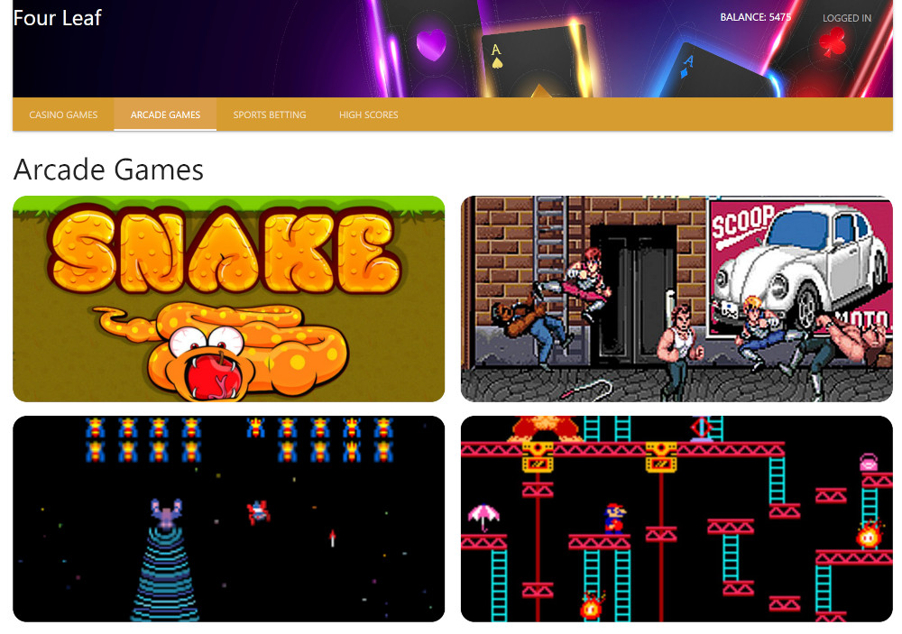
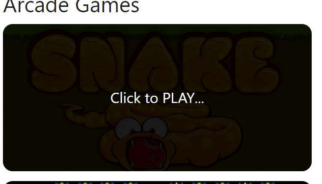
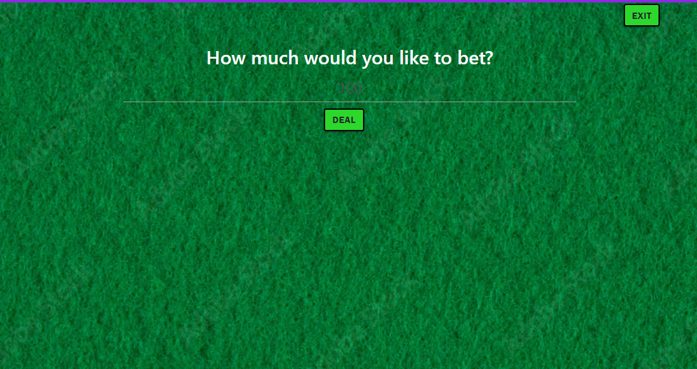
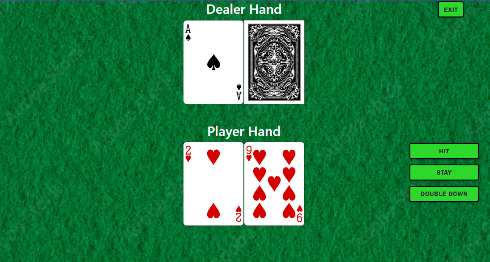

# Gamblers Anonymous

## Description
Create a website that allows a user/player to gamble their money to try and beat the house. The main drive was understanding how to interface with HTML/CSS/JavaScript. This code allows a user to have fun playing games and winning money. We all learned a lot working on this. The site uses Materilize as the primary CSS framework but some of the games where developed using Bootstrap.
Jacob - When working with javascript you have to be careful when multiplying and dividing numbers and strings. It does not convert the string to a number but instead the number to a string.
Nicholas - How to append code to HTML using Javascript to have a dynamic webpage. How important clear communication is when dealing with groups. Its always talked about but seeing it happen really helps reinforce how useful it is.
Arnasia - This project I learned how to write code in a  feature branch. The process of merging and dealing with conflicts was a headache but the more I had to deal with it the easier I understood what to do. I learned how to work with a group using github. The experience was totally different than working individually. The ability to build something based on a realistic time frame. Its important to have a wireframe to give you a visual of your formatting. Wireframes are excellent references. I experienced hands-on how working as a group communicating pretty frequently is essential to where you are in your project and also helps keep the flow of the process. Overall the experience was a learning process far as code, working with people that are on different levels of one another and trying to get the web to respond in the manner I had in mind. This project took a lot of research. Learning how to read documents really played a huge role in using a css framework for the first time.

## Installation
N/A

## Usage
To start you need to login - click the sign-in/login button in the upper right corner
If you want to do some gambling select either a casino game or some sports betting. If you just want to play some fun games checkout the arcade games.

Select a game by clicking on the picture.

Blackjack
[Standard blackjack rules](https://bicyclecards.com/how-to-play/blackjack/) but no splitting 
Enter your bet on the line above
Hit deal to start the game

Hit/Stand/Double Down are on the right of your cards. If you double down you only get 1 card.
Hit exit to leave the game

Slots
Just a demo no betting. Just hit spin to see the game play out and try your luck. Hit exit to leave the game.

Snake Game
Grab the fruit to increase the size of the snake. As the snake gets bigger remember to not let the snake eat himself. Use the arrow keys to change the snakes direction. There are no walls so if you run off the screen you end up on the other side of the screen.

Sports Betting
Select a team to increase the payout. If you want to remove a game from the lineup select none. Hit submit bet to confirm your choices.

## Technologies
Bootstrap
Materialize
the-odds-api
deckofcardsapi
Jquery.js
Moment.js

## Credits
N/A

## License
MIT